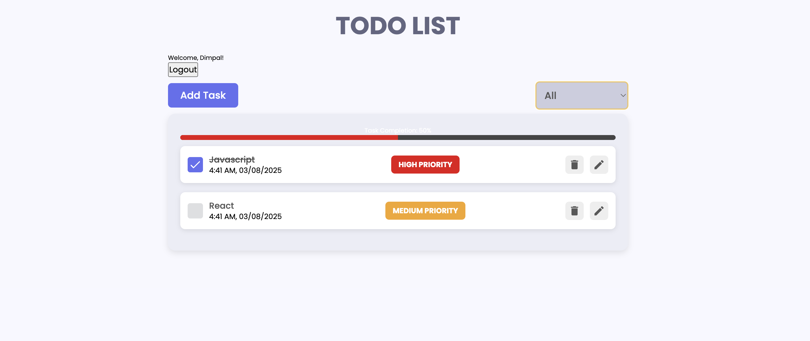

# React Todo App.

A complete todo application with all features.

**live demo: [https://todo-list-using-react-ifn5.vercel.app/](https://todo-list-using-react-ifn5.vercel.app/)**

---

### Made ❤️ by [Dimpal Gogoi]

---

## Project Description

This project is a complete Todo application built using React.js with Redux for state management and Framer Motion for smooth animations. It covers all CRUD (Create, Read, Update, Delete,login) operations, allowing users to add, update, and remove tasks seamlessly.

The application is designed to be beginner-friendly, making it an excellent learning experience for those new to React and Redux. Along the way, i will also explore simple animations to enhance the user experience.

###### Key Features:
- ✅ React.js for building an interactive UI
- ✅ Redux for efficient state management
- ✅ Framer Motion for adding smooth animations
- ✅ Complete CRUD functionality
- ✅ Beginner-friendly approach with step-by-step implementation

This project will help strengthen React and Redux fundamentals while introducing exciting UI animations. Let’s build something awesome together! 🚀

## What i going to learn/use

- [React](https://reactjs.org/)
- [React Redux](https://redux.js.org/)
- [Framer Motion](https://framer.com/motion/)
- [React icons](https://react-icons.netlify.com/)
- [React Hot Toast](https://react-hot-toast.com/)
- More...

## Requirements

- Basic ReactJs knowledge
- Basic HTML, CSS knowledge

## Tools Used

1. Favicon: [Flaticon.com](https://www.flaticon.com/)
1. Code Editor: [VS Code](https://code.visualstudio.com/)

---

Happy Coding! 🚀
